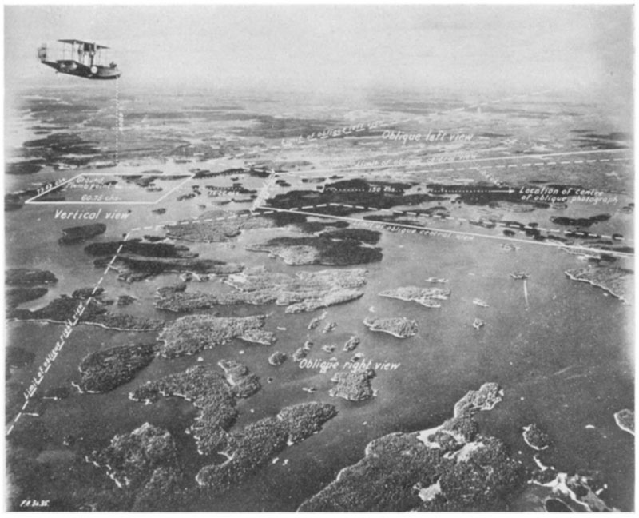
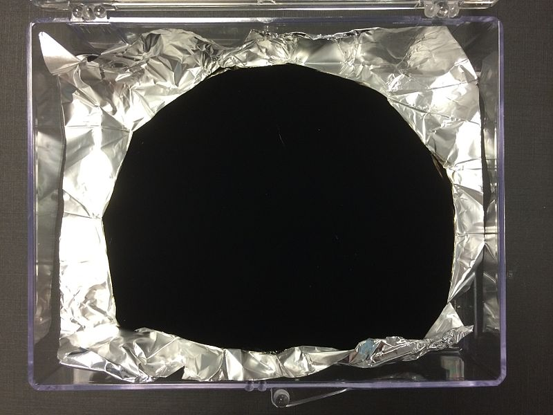
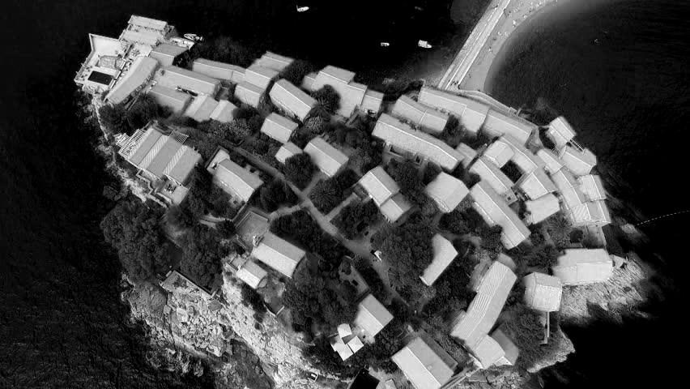
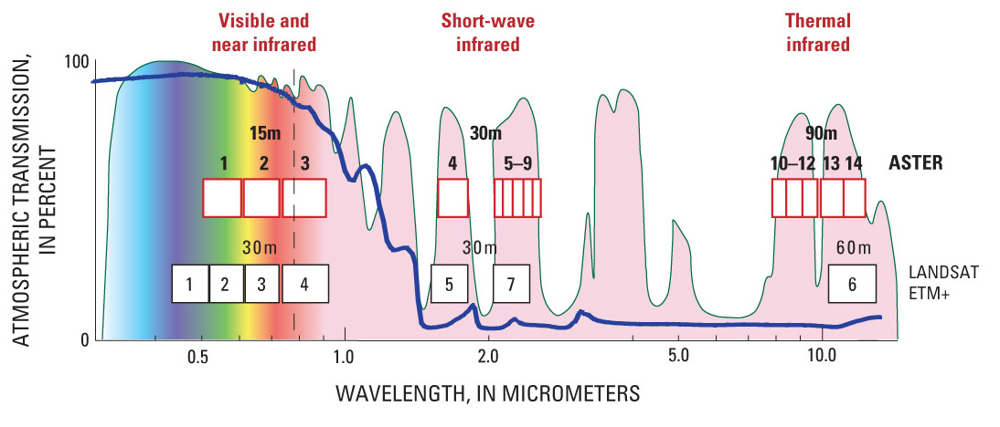
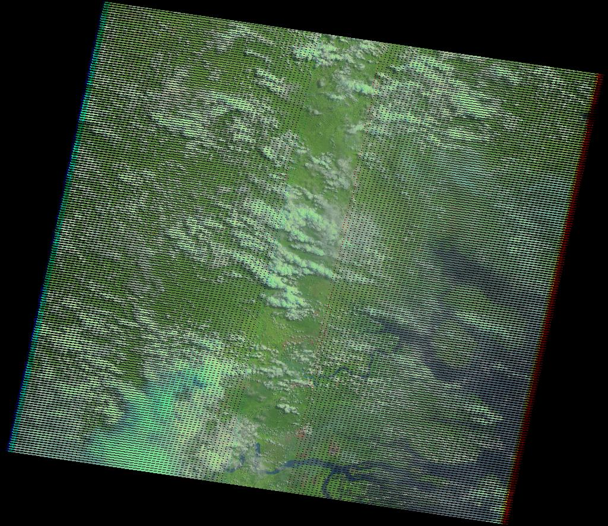
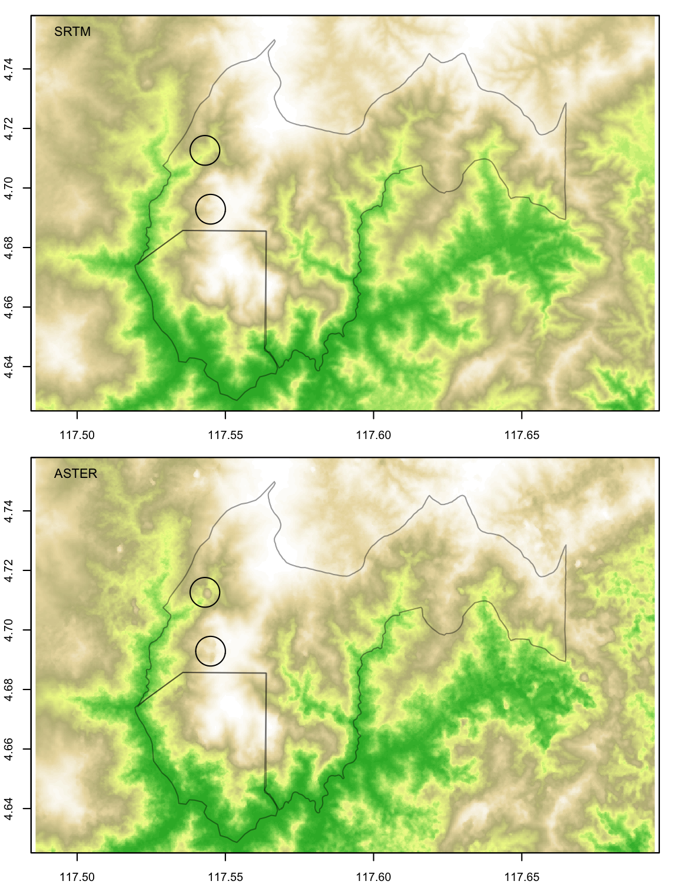
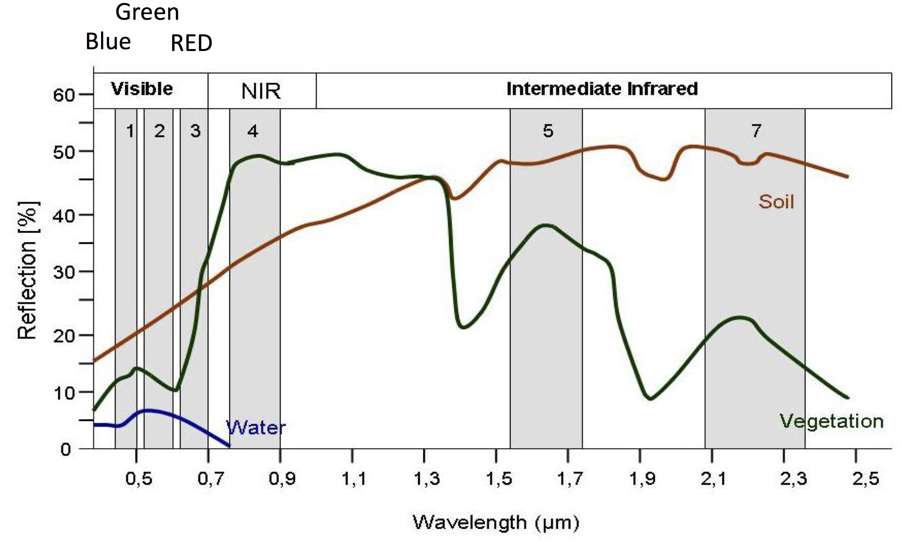
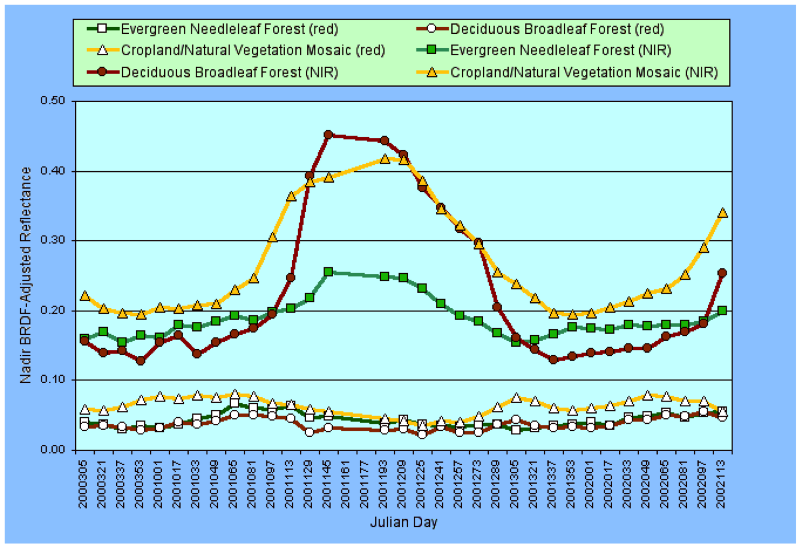
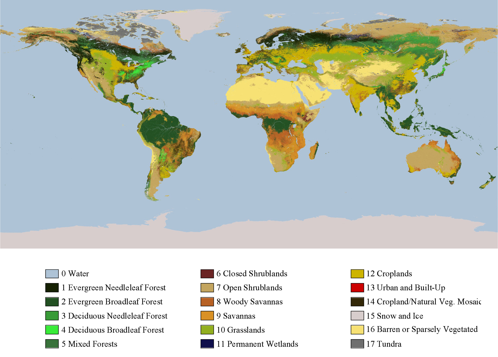
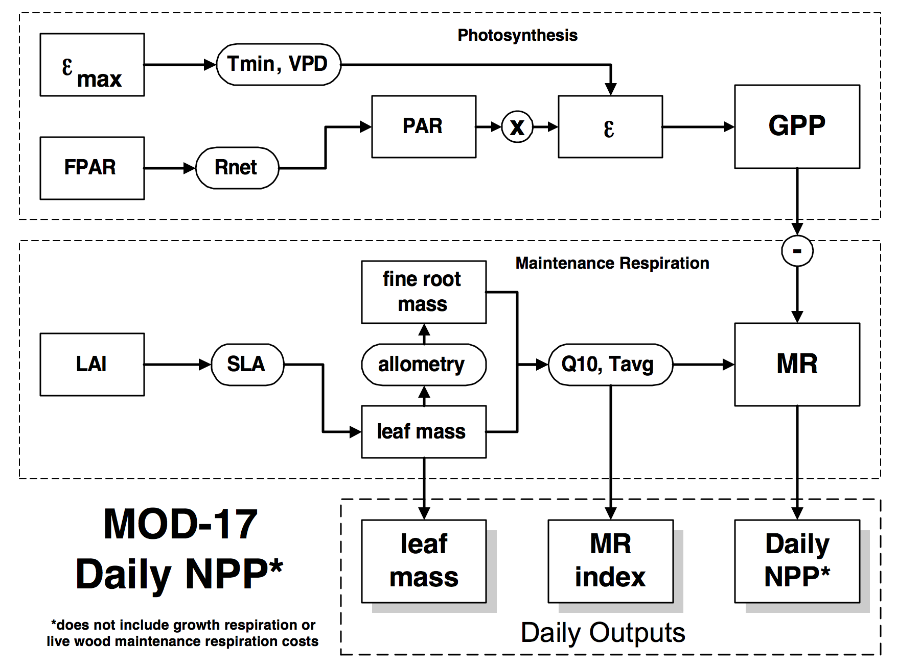

<!-- .slide: data-background-image="../shared_images/World3D_600.png"  data-background-position="right 10px bottom 20px"  data-background-size="40%" -->
# Remote Sensing

### David Orme

---

# Overview

  1. Remote sensing concepts
  2. Resolution:
    - Spectral
    - Spatial
    - Temporal
  3. Earth observation products

---

# Mapping landscapes manually

**Pros**

  - Very fine level of detail

**Cons**

  - Expensive
  - Slow
  - Inconsistency between locations and sampling periods

---

# Maps from images

Aerial photography  
(1900s)

Satellite imagery  
(1950s)

Notes: 
Elifrits et al. 1978 Mapping land cover from satellite images: A basic, low cost approach. EARTH RESOURCES AND REMOTE SENSING. Image taken from a V2 rocket in 1946

---

# Remote sensing

Remote sensors can be:

**Passive**: sense reflected solar radiation

**Active**:  emit and sense reflected

  - LIDAR (light)
  - RADAR (microwaves)
  - Alteration in reflected light 
  - Trip time gives heights

---

# Reflectance

**Albedo**: the proportion of radiation reflected from a surface, **strongly** affected by texture and angle of incidence.

----

# Electromagnetic spectrum

----

# Reflectance

**Monochrome images**

  - Different objects have different albedo
  - Construct maps by looking at contrast, texture and edges

----

# Reflectance

**Multispectral images**  

  - Albedo of surfaces vary with wavelength 
  - Compare **bands** recording reflectance in different wavelengths

----

## Reflectance

<!-- .element width="50%" --> 

---

# Satellite orbits

  - **High earth** geostationary orbits (weather satellites), 
  - **Mid earth orbits** (navigation and communications)
  - **Low earth orbits**   
  (earth observation)
  -  **Sun synchronous** orbit (same time of day)

Notes: 
HEO: stationary, MEO: 2-24 hour orbits, LEO: 90 - 120 minutes

---

# Spatiotemporal resolution

**Low earth orbits**:

 - Close to the planet
 - High spatial resolution
 - Narrow path widths
 - Small scenes
 - Less frequent images
 - Use **constellations** of satellites

----

# Spatiotemporal resolution

**High earth orbits**:

 - Far out in space
 - Low spatial resolution
 - No path width
 - Global scenes
 - Can take images constantly

----

## Spatiotemporal resolution

To put it another way:

**Meteosat**

**Pleiades**
<!-- .element width="80%" --> 

---

# Spectral resolution

  - Determined by the satellite mission
  - Constrained by absorption of radiation by the atmosphere
  - Light gathering sets resolution and band width

Notes:
Pink areas on image show atmospheric absorption / transmission

---

# Example platforms

| Satellite 	| N 	| Bands	| Revisit	| Resolution (m)	|
|---|---:|---:|---:|---|
| Pleiades 	| 2 	| 5	| 1	| 2 / 0.5	|
| Rapid  Eye	| 5 	| 5	| 1	| 5	|
| Spot  7	| 1 	| 5	| 2-3	| 6 / 1.5	|
| ASTER 	| 1 	| 14	| 16 	| 90 / 30 / 15	|
| Landsat  8	| 1 	| 11	| 16 	| 100 / 30 / 15	|
| MODIS Terra	| 1 	| 36	| 1 - 2 | 1000 / 500 / 250	|

---

# Using satellite images

----

# Using satellite images

Multiple steps may be needed to use data:

  - **Georeferencing**: where is the image?
  - **Orthorectification**: remove perspective and terrain effects
  - **Calibration**: convert the sensor value (an integer ) to an actual reflectance value
  - **Atmospheric correction**: aerosols and water vapour can all impose spectral biases on reflected light and vary on a daily basis.

----

# Using satellite images

<!-- .element width="65%" --> 

Notes:
Failure of the scan line corrector in 2003

----

# Earth observation products

	
Use satellite reflectance data to produce derived maps

  - Use standardised algorithms
  - Map land surface traits at global scale 
  - Temporal scales: daily to annual 
  - Resolution: 250 m to > 8 km spatial resolution
  - Validation: many have pixel by pixel 'accuracy'

Four examples of increasing complexity

----

# Vegetation indices

Simple direct calculation from sensor values:

  - Normalized Difference Vegetation Index:

$${\mbox{NDVI}}={\frac  {({\mbox{NIR}}-{\mbox{RED}})}{({\mbox{NIR}}+{\mbox{RED}})}}$$

  - Enhanced Vegetation Index:

$${\displaystyle EVI=G\cdot {\frac {(\mbox{NIR}-\mbox{RED})}{(\mbox{NIR}+C_1\cdot \mbox{RED}-C_2\cdot \mbox{Blue}+L)}}}$$

<!--- Soil and Atmospherically Resistant Vegetation Index:  
$${\displaystyle {\mbox{SAVI}}={\frac {({\mbox{1}}+{\mbox{L}})({\mbox{NIR}}-{\mbox{Red}})}{({\mbox{NIR}}+{\mbox{Red}}+{\mbox{L}})}}}$$ -->

----

# Digital elevation models

  - Shuttle Radar Topography Mission (SRTM)
  - ASTER Terra DEM (stereoscopy)
  - Both near global with 30 metre resolution

<!-- .element width="85%" --> 

---

# Fire signatures

Live fires:

   - Spectral signature in **Infrared bands**
   - [http://fires.globalforestwatch.org/map](http://fires.globalforestwatch.org/map)
   - MODIS daily and 8 day fire observations at 1km resolution 
   - SPOT: annual fire frequencies (2000 - 2007)

Burned area:

  - Change detection in successive images around fire pixels
  - MODIS: monthly burned area in 500m pixels

---

# Land cover

Spectral signatures differ **between different surfaces**:

<!-- .element width="85%" --> 

----

# Land cover

Spectral signatures differ **over time**:

<!-- .element width="75%" --> 

----

# Land cover

 **Ground sampling** ties spectral signatures to habitats

<!-- .element width="85%" --> 

----

# Land cover

Profiles can then be used to **classify** pixels to habitats

<!-- .element width="70%" --> 

----

# Land cover

Examples:

  - MODIS: Annual summaries at 500 metre resolution using five different classification schemes
  - [http://landcover.org/data/](http://landcover.org/data/)
  - [Global Forest Change](https://earthenginepartners.appspot.com/science-2013-global-forest)

---

# Productivity

Plants use light to store carbon.  If we know:

  - The amount of **photosynthetically active light** absorbed
  - The **radiation conversion efficiency**, given
     - the temperature and
     - humidity.
  - Respiration costs.
  
Then we can predict gross and net primary productivity.

---

# Productivity

  - Remotely sensed reflected light
  - Ground measured incident light
  - Biome based models for:
     - conversion efficiency
     - respiration

---

# Obtaining data

  - [http://reverb.echo.nasa.gov/](http://reverb.echo.nasa.gov/)
  - [http://earthexplorer.usgs.gov/](http://earthexplorer.usgs.gov/)
  - [http://srtm.csi.cgiar.org/](http://srtm.csi.cgiar.org/)
  - [https://earth.esa.int/web/guest/eoli](https://earth.esa.int/web/guest/eoli)

